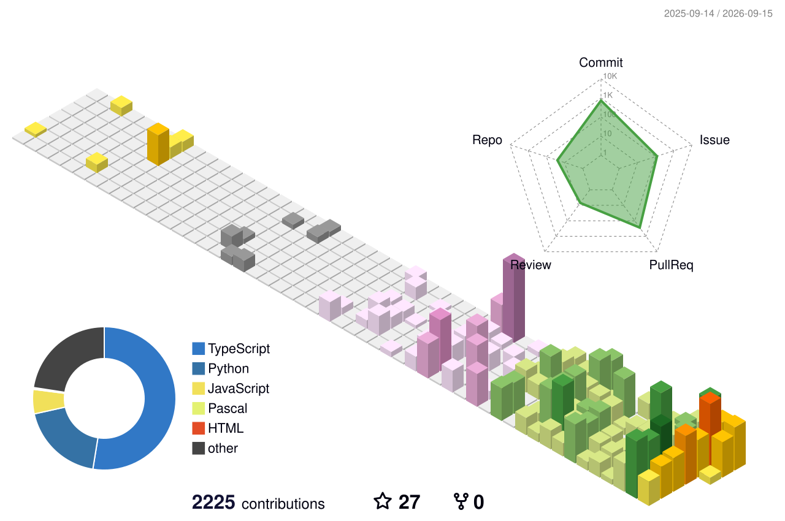

## Hi there, I'm Ján from Slovakia 👋

I am a developer, hardware tinkerer, and a little enthusiast of stars. Long time user of Home Assistant.

**I create useful astronomical tools and H.A. integrations to make the world a better place to live.**

### 🔭 What I'm currently working on:
*   **DevControl 2 System for Bombol.Space**: Setting up and managing a control system for a telescope hosting facility in Piconcillo.
*   **DevControl Home**: Building a robust, fully local smart home automation system based on Home Assistant (HAOS) and Raspberry Pi.
*   **Visual Astro**: Building an open-source web app for CCD and visual astronomy measurements, featuring a comprehensive suite of essential tools.
*   Developing custom hardware solutions, environmental monitoring sensors, and more.

### 🛠️ Tech & Tools:

*   **Hardware:** Raspberry Pi (4 & 5), Microcontrollers, DIY Electronics
*   **Software & Protocols:** Home Assistant OS, MQTT, Local Automations

### 📫 How to reach me:
*   🌐 **Website:** I don't have time to update it...
*   📧 **Email:** j44soft@gmail.com

### ⚡ Fun fact:
😂 My code is about 35-90% written by AI, but 90% of the hardware short-circuits are my own doing!
